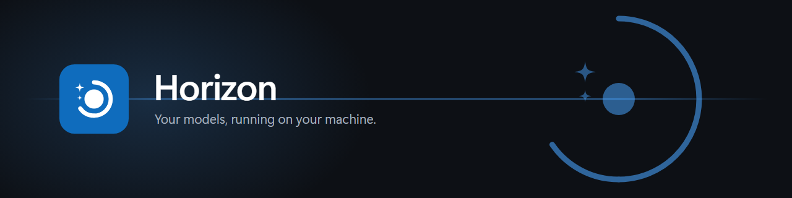



# Horizon

A private, air-gapped AI workspace built on **Microsoft Foundry Local**. Chats, saved prompts, memory and a document library — with the runtime managed for you, not left to a terminal.

Nothing you type is sent to the internet by Horizon. There is no account to create, no API key, no subscription, and no cloud service involved. Once your models are cached, the whole thing works with the network switched off — and the Connection panel shows you exactly what Horizon can and cannot vouch for.

## Who this is for

Not only developers. Horizon exists for anyone who wants an assistant that is *theirs*:

- A student or researcher working with drafts they would rather not upload
- A consultant, lawyer or clinician handling material that must not leave the building
- Someone on a boat, a plane, a field site, or any connection they cannot rely on
- Anyone who wants to experiment with a language model without an account, a subscription, a token budget, or a quota

The goal is not to manage inference runtimes. The goal is to have somewhere to keep your chats, your prompts, your documents and your notes, with a model that answers from your own hardware. Foundry Local does the running; Horizon is the place you work.

## Is this the right tool for you?

Horizon **manages the Foundry Local service itself** rather than treating it as one backend among many. It starts and stops the service, downloads and loads models, re-discovers the port when Foundry restarts, and unloads the model to give you the memory back when you are done. That is the whole point of it.

If you want a general-purpose front end that speaks to many providers — OpenAI, Anthropic, Ollama, Foundry Local and others behind one interface — then [Open WebUI](https://github.com/open-webui/open-webui) or [AnythingLLM](https://github.com/Mintplex-Labs/anything-llm) will serve you better. Both are mature, well supported, and have far more features than this does. Point them at Foundry Local's endpoint and they work.

Choose Horizon if you want the opposite trade: one runtime, understood properly, with no Docker, no Electron, no account, and nothing to install beyond Node.js to run it.

## What you actually need

- Windows 10 or Windows 11
- PowerShell 5.1 or later (already included with Windows)
- Node.js 18 or later
- Roughly 10 GB of free disk space for the model and its supporting files
- Internet access **for the one-time setup only**
- A microphone, only if you want to dictate. That is optional and off by default.

## Getting started

No terminal knowledge needed. If you have never used one, follow **A**.

### A. The simple way — download the ZIP

**1. Install Foundry Local and Node.js**

Open **PowerShell** from the Start menu (just type `powershell`), paste these two lines in, and press Enter after each. This is the only time you need it.

```powershell
winget install Microsoft.FoundryLocal
winget install OpenJS.NodeJS.LTS
```

If `winget` is not recognised, download them by hand instead: [Foundry Local](https://learn.microsoft.com/en-us/azure/foundry-local/get-started) and [Node.js](https://nodejs.org) (choose the **LTS** version).

**2. Download Horizon**

On the [project page](https://github.com/itstejaswi/horizon), click the green **Code** button, then **Download ZIP**.

**3. Unblock the ZIP before extracting**

Windows marks files that come from the internet. Clearing the mark on the ZIP is one click, and saves you clearing it on every file afterwards.

- Right-click the downloaded `horizon-main.zip`
- Choose **Properties**
- At the bottom of the **General** tab, tick **Unblock**
- Click **OK**

If you do not see an Unblock box, there is nothing to clear — carry on.

**4. Extract it**

Right-click the ZIP, choose **Extract All…**, and put it somewhere that belongs to you, such as:

```text
C:\Users\<your name>\Documents\horizon
```

Avoid `C:\Program Files` — Windows restricts writing there, and Horizon keeps its settings beside itself.

**5. Double-click `Start Horizon.bat`**

A small black window opens — that is the server, and it stays open while Horizon runs. Your browser opens at:

```text
http://127.0.0.1:3000
```

The first launch downloads the model, which is around 8.4 GB and takes a while. After that it works offline.

> ⚠️ **Do not close the black window to quit.** That window *is* the server. Closing it kills Horizon mid-request and leaves the model — several gigabytes — sitting in memory. Use the **power button** at the bottom of the left rail instead: it unloads the model, optionally stops the Foundry service, and gives the memory back. `Ctrl+C` in that window does the same thing properly.

> If Windows shows **"Windows protected your PC"**, click **More info** then **Run anyway**. That warning appears for any file from the internet that is not commercially signed. Ticking Unblock in step 3 usually prevents it.

### B. If you have Git

Cloning avoids the unblock step entirely, because files created by Git are not tagged as coming from the internet.

```powershell
winget install Microsoft.FoundryLocal
winget install OpenJS.NodeJS.LTS
git clone https://github.com/itstejaswi/horizon
cd horizon
.\"Start Horizon.bat"
```

There is no `npm install` step to chat with a model. Horizon's core has no runtime dependencies.

Dictation is the one exception. Speaking instead of typing needs a terminal helper that Node does not provide, so it is an *optional* dependency:

```powershell
cd path\to\horizon
npm install
```

If that fails, or you skip it, Horizon still runs and chat is unaffected — the microphone button simply does not appear, and the page says why. Prebuilt helpers ship for Windows and macOS; on Linux `npm install` will try to build it, which needs a compiler.

Dictation is switched off until you ask for it, because it opens the microphone and holds a second model in memory. Turn it on in `config.local.json`:

```json
{ "dictation": { "enabled": true } }
```

The first recording downloads a speech model (about 700 MB) and loads it, which takes a moment. Horizon says so while it happens.

**Worth knowing before you use it:** Horizon does not record through your browser. It asks Foundry Local to open the microphone directly, so your browser shows no permission prompt and no recording indicator in the tab — Windows attributes the microphone to *Foundry Local CLI*, not to your browser. Horizon shows its own red banner for as long as the microphone is open, and that banner is the only signal the page can give you.

### Already extracted without unblocking?

Clear the tag on everything at once:

```powershell
cd path\to\horizon
Get-ChildItem -Recurse | Unblock-File
```

### If you prefer PowerShell

```powershell
.\scripts\Start-Horizon.ps1
```

Same thing, but it also starts Foundry and pre-loads your model so the first message is quick.

Everything after that is managed from the page itself — starting and stopping the Foundry service, downloading and removing models, switching between them, and changing settings. You should not need a terminal again.

### Closing it properly

Use the **power button** at the bottom of the left rail, or press `Ctrl+C` in the launcher window.

This matters. A loaded model stays resident in the Foundry service — around 8.4 GB for phi-4 — and closing the browser tab alone will not release it. Closing safely unloads the model, optionally stops the Foundry service, and returns the memory. The browser will warn you if you try to close the tab while a model is still loaded.

## The interface

A left rail holds everything, in the way you would expect from a modern chat app.

| Section | What it does |
|---|---|
| **Chats** | Every conversation, saved. Rename, delete, or clear the lot. |
| **Prompts** | Reusable openings. Pick one and it lands in the message box ready to finish. |
| **Memory** | Facts you want remembered across every chat, added to the model's instructions each time. Toggle it off whenever you like. |
| **Library** | Replies you chose to keep, via **Save** under any answer. |
| **Connection** | The health of every hop, plus the air-gap indicator. |
| **Traffic** | What was sent and received, at a recording level you choose. |
| **Settings** | Instructions, creativity, storage usage, and a single button to erase everything. |

The model picker sits in the top bar. It lists every model on your machine with its hardware target and size; choosing one switches live, with no restart, keeping your conversation.

Light, dark, and match-Windows themes are in the top right. Your choice is remembered.

### Where your data lives

Chats, prompts, memory and library entries are stored in **this browser's local storage on this machine**. They are never uploaded, and the Horizon server never sees them — it only receives the messages you actually send. Settings shows how much space they occupy, and **Erase all data** removes every trace.

Clearing your browser's site data will also delete them, so treat them as convenience rather than an archive.

## Everyday use

`Start Horizon.bat` is the one entry point. Everything else is a shortcut to it.

| What you want | What to do |
| --- | --- |
| Start it | Double-click **`Start Horizon.bat`** |
| Start it every time you sign in | Settings → **This machine** → *Start when I sign in* |
| A desktop icon | Settings → **This machine** → *Desktop shortcut* |
| Its own window, no browser tabs | Browser menu → Apps → **Install Horizon** |
| Open it when it is already running | Click the shortcut again — it opens the page rather than starting a second copy |
| Stop it | Power button in the left rail, or `Ctrl+C` in the launcher window |

Both shortcut options write a normal `.lnk` into your own Start Menu and Desktop folders. They need no administrator rights, trigger no UAC prompt, and unticking the box deletes the file again. Nothing is written to the registry.

### What "start when I sign in" actually does

It launches `Start Horizon.bat` **minimised**. You will see a *Horizon* entry in the taskbar — that console window is the server, and it is deliberately visible rather than hidden, because it is also the honest way to stop it.

Horizon itself is small: around **55 MB** of memory sitting idle. What costs real memory is a *model*, and no model is loaded until you ask for one. The **Service** tab shows both numbers side by side.

### Launching it twice

Horizon only ever runs one server. If you click the shortcut while it is already running, the second launch checks the first is genuinely alive, opens that page in your browser, and exits — it will not start a competing server or take over the first one's port.

## Working with files and links

**Attach a text file** with the **+** button in the composer, or drag one onto it. The file is read in your browser and folded into your message — nothing is uploaded anywhere. If a file is longer than a message can carry, the chip says so plainly rather than silently sending a fraction of it.

**Links are a different matter, and worth understanding.**

A model cannot open a link. Asked to summarise one, it reads the words in the address and writes plausible prose around them. Tested with a deliberately invented news URL, phi-4 produced a confident, detailed summary of an event that had never happened — including policy analysis. Nothing about the answer looked wrong.

So when you paste a link, Horizon says so:

- **By default**, an amber note: *the model can't open links, details may be invented.*
- **If you switch on link reading** in Settings, Horizon fetches the page itself and hands the model the real text. The note turns blue and says what will happen.

Link reading is **off by default**, because it is the one part of Horizon that leaves your computer. When it is on:

- The request goes to that site, which sees your address, exactly as a browser visit would
- **The page content stays here.** It goes to your local model and nowhere else
- Private and local addresses are always blocked, so a pasted link cannot reach your router, a service on `localhost`, or a cloud metadata endpoint
- Pages that need a sign-in, and those built entirely by JavaScript, will not read — and say so rather than pretending

A message shows what came with it: a chip for each file and each page, struck through if a page could not be read.

## Keeping your data

Your chats, prompts, memory and saved replies live in your **browser's own storage**. That is private — nothing is written to disk — but it is also fragile: clearing your browsing data wipes it, and another browser cannot see it.

Settings → **Your data** → *Keep a copy on this computer* writes everything to a plain JSON file, including your instructions and preferences. If Horizon later finds an empty browser and a saved copy, it offers to restore it.

This is off by default, and the file is readable without Horizon.

## About and privacy

The **?** button opens a page that separates three things people usually blur together:

- **Horizon** collects nothing, has no telemetry, and talks to one address: your local Foundry service. The request log, under Settings > Foundry, lets you verify that rather than trust it.
- **Foundry Local** is Microsoft's software. It reaches the internet for models and its catalogue. We observed no other outbound traffic while it sat idle or answered a message, but we cannot prove the absence of telemetry and do not claim to.
- **The model** has no network access of its own.

## Running the tests

```powershell
npm test
```

The regression suite runs entirely on this machine against a stub, so it needs no model, no GPU and no network. It covers config resolution, loopback enforcement, port fallback, path traversal, command injection, streaming, and behaviour when Foundry is not running.

## The four scripts

| Script | What it does | When to run it |
|---|---|---|
| `Setup-Horizon.ps1` | Installs Foundry Local and downloads the model | Once per machine |
| `Start-Horizon.ps1` | Starts everything and opens the chat page | Every time you want to chat |
| `Optimize-Horizon.ps1` | Benchmarks your hardware and picks the fastest model | Once, or when replies feel slow |
| `Test-Horizon.ps1` | Checks that all three pieces are healthy | When something seems wrong |
| `Stop-Horizon.ps1` | Shuts everything down and frees memory | When you are done |

## Making it fast

Run this to measure your own machine rather than guess:

```powershell
.\scripts\Optimize-Horizon.ps1 -Apply
```

It inspects your CPU, GPU and NPU, checks which accelerated model variants Foundry can actually use, times a real completion for each downloaded model, and writes the winner to `config.local.json`. Add `-IncludeCandidates` to have it download and compare a couple of small, fast chat models too.

### What actually affects speed

Some things are fixed by your hardware, and some are not.

| Lever | Effect | Already handled |
|---|---|---|
| **Streaming replies** | Text appears as it is generated instead of all at once at the end. On a slow machine this is the difference between waiting 20 seconds and reading after 1. | Yes, on by default |
| **Model size** | The single biggest real lever. A 1.5B model is several times faster than a 14B one. | `Optimize-Horizon.ps1` finds the fastest |
| **Reasoning models** | Models like `qwen3` "think out loud" before answering, spending hundreds of tokens first. Measured here: **1067 tokens to answer "say hello in five words"**. | Folded into a collapsible section; the optimiser prefers non-reasoning models |
| **Warm-up** | The first completion after loading is much slower than the rest. | Done at startup, before you type |
| **Keeping the model loaded** | If Foundry unloads the model, the next message pays the load cost again. | Optimiser disables the idle timeout |
| **Conversation length** | Every message re-sends the history for reprocessing. Long chats get slower. | Capped by `chat.historyLimit`; the app tells you when older messages are dropped |
| **Raw tokens per second** | Fixed by your GPU, CPU and memory bandwidth. Nothing in software changes this. | Not fixable, but measured and reported |

### A note on ARM machines

On Snapdragon X Elite hardware, Windows reports an NPU, but Foundry Local 0.10.3 publishes **no NPU model variants** — every catalogue entry targets CPU, except `phi-4` which has a WebGPU variant. The NPU therefore sits idle. `Optimize-Horizon.ps1` detects this and says so plainly rather than letting you assume otherwise.

Measured on a Snapdragon X Elite X1E80100:

| Model | Backend | Tokens/second |
|---|---|---|
| `phi-4` (14B) | WebGPU (Adreno) | 6.1 |
| `qwen3-1.7b` | CPU | 8.3 |

At these rates streaming matters enormously: time to the first visible word was **1.1 seconds**, against 21.8 seconds for the complete reply.

## How the pieces fit together

```text
Your browser
  -> Node.js web server        (loopback only, port chosen at run time)
  -> Foundry Local REST API    (loopback only, port chosen by Foundry)
  -> the model, on your hardware
```

Your browser never talks to Foundry directly. It only talks to the small Node.js server in this folder, which passes the message along locally.

## Configuration

Every adjustable value lives in **`config.json`**. There is exactly one place to change any given setting.

| Setting | Default | Meaning |
|---|---|---|
| `web.port` | `3000` | The address you open. If it is busy, Horizon moves to the next free port and says so. Set `0` to always let the system choose. |
| `web.portSearchLimit` | `20` | If a pinned port is busy, how many ports upward to try before giving up. |
| `web.openBrowser` | `true` | Open the browser automatically on start. |
| `model.alias` | `phi-4` | Which Foundry model to load. Change this to use a different one. |
| `chat.systemPrompt` | *(see file)* | The instruction that shapes the model's personality. |
| `chat.temperature` | `0.7` | Creativity. Lower is focused, higher is varied. |
| `chat.historyLimit` | `30` | How many past messages are sent back to the model. |
| `chat.stream` | `true` | Show words as they are produced. Turning this off makes replies feel much slower. |
| `foundry.warmUpOnStart` | `true` | Send a throwaway request at startup so your first real message is quick. |
| `foundry.unloadOnExit` | `true` | Release the model from memory when Horizon shuts down. |
| `foundry.stopServiceOnExit` | `false` | Also stop the Foundry service on exit. See the note below. |
| `foundry.requestTimeoutMs` | `120000` | How long to wait for a reply before giving up. |
| `backup.enabled` | `false` | Keep a copy of your chats, prompts, memory and preferences on disk. |
| `backup.directory` | *(your home folder)* | Where that copy is written. |
| `reader.enabled` | `false` | Let Horizon fetch a page you paste and give the text to the model. |
| `reader.maxChars` | `12000` | How much of a page to pass along. |

Both `backup` and `reader` are off by default and are normally switched on from **Settings** rather than edited here. The choice is written to `config.local.json`, which is not tracked by git.

### Memory, and shutting down cleanly

A loaded model stays resident in the Foundry service — it does **not** go away when you close the browser tab, and it would not go away when Horizon exited either. On this machine phi-4 alone accounts for around 8.4 GB.

So Horizon releases what it loaded. Press `Ctrl+C`, or run `Stop-Horizon.ps1`, and you will see:

```text
Shutdown request received. Shutting down...
  Releasing phi-4 from memory... done
  Goodbye.
```

Only models **this instance loaded** are released, so a model you loaded yourself from the command line is left alone.

One caveat worth knowing: unloading the model frees it inside the service, but the Foundry daemon keeps a large working set of its own. Measured here, the daemon still held 26.4 GB after the model was unloaded, and only stopping the service returned it — free memory went from 14.1 GB to 40.6 GB. If you want that memory back when you finish, either run `Stop-Horizon.ps1`, which stops the service, or set:

```json
"foundry": { "stopServiceOnExit": true }
```

### Ports are never hardcoded

Both ports are decided while the program runs:

- **Foundry Local** picks its own port and can change it between runs. The launcher reads the current one from `foundry server status`.
- **The web server** defaults to `web.port: 0`, letting Windows hand it a free port. If you pin a port and it turns out to be occupied, it moves to the next free one and tells you it did so, rather than crashing.

The chosen values are written to `.runtime/horizon.json` while the app runs, so `Stop` and `Test` read them from there instead of guessing.

### Overriding without editing files

Settings resolve in this order, with earlier entries winning:

```text
command-line argument  >  environment variable  >  config.local.json  >  config.json  >  built-in default
```

```powershell
# Pin a port for one run only
.\scripts\Start-Horizon.ps1 -WebPort 3000

# Try a completely different model
.\scripts\Start-Horizon.ps1 -ModelAlias qwen2.5-0.5b

# Start without opening a browser
.\scripts\Start-Horizon.ps1 -NoBrowser
```

Create `config.local.json` for personal settings you do not want committed to source control. It is ignored by git and overlays `config.json`.

## The control panel

Click the panel icon in the top right. It has three tabs, and its purpose is to let you *verify* the privacy claim rather than take it on trust.

### Connection

Shows the health of every hop in the chain — browser → local web server → Foundry service → model — each with its own state, address, and response time. When something breaks, you can see exactly which link failed instead of guessing.

Above it sits the **air-gap indicator**. When your machine has no network, it says so plainly: nothing could leave this computer even if it tried. This is detected **passively** from the browser's own connectivity signal; Horizon never makes an outbound request to test for internet, because doing so would defeat the entire point.

The same badge doubles as an **activity light**. Horizon reaches the internet for exactly one reason — fetching a page you asked it to read — and while that fetch is happening the badge turns amber, pulses, and names the host: *Reading example.com*. It works the way your operating system shows an indicator while the camera or microphone is live. Nothing leaves this machine without lighting it up.

To be precise about what is happening: the **model** has no network access at all. Horizon fetches the page and hands the text over. The badge reports Horizon reaching out, not the model.

Beneath it is a scope note: Horizon collects no telemetry and has no analytics, and it does not control Foundry Local or the model. The panel links to Microsoft's Foundry Local documentation so you can check how those handle the network yourself.

### Traffic

Every request and response, with a **recording level** you control:

| Level | Keeps | Use when |
|---|---|---|
| **Off** | Nothing | Working with very large inputs and you want the page as light as possible |
| **Summary** | Sizes and timings only | The sensible default — safe with documents of any size |
| **Full** | Complete bodies, truncated at 4 KB each | You want to read exactly what was sent |

Only the last 20 exchanges are kept, and each body is capped, so the page cannot accumulate megabytes of text no matter how large your inputs are. This is the strongest answer to "how do I know nothing is being uploaded?" — you can read the entire exchange and see it only ever goes to `127.0.0.1`.

### Models

Every model downloaded on this machine, with its hardware target and size. Switch between them with one click — no restart, and your conversation is kept. The model currently in use and any others still resident in memory are marked.

## Trying things out

Click the gear icon to experiment live:

- **Instructions for the model** — change its character. Try `You are a terse pirate.` and send a message.
- **Creativity** — drag to `0` and ask the same question twice; you should get near-identical answers. Drag to `1.8` and the replies get far more inventive.

Both apply to your next message. No restart needed.

The sun/moon icon cycles between following Windows, light, and dark.

While a reply is generating, the send button becomes a stop button. `Esc` also stops it. Anything already written is kept.

If the model thinks out loud before answering, that working is tucked into a **Working it out** section you can expand. The answer itself stays clean.

Under the message box you get real numbers for each reply: how many tokens, how fast, and how long until the first words appeared.

## Using a different model

The code contains no model-specific logic. Download another Foundry model and point at it:

```powershell
foundry model list
.\scripts\Setup-Horizon.ps1 -ModelAlias qwen2.5-0.5b
.\scripts\Start-Horizon.ps1 -ModelAlias qwen2.5-0.5b
```

To make the change permanent, edit `model.alias` in `config.json`.

## Running with no internet

### What Horizon promises

Horizon sends nothing outward. Every request it makes goes to `127.0.0.1`, and the request log under Settings > Foundry lets you verify that message by message. It collects **no telemetry** and has **no analytics**.

It does not control Foundry Local or the model itself — those are separate processes. For how they handle the network, check your Foundry configuration and [Microsoft's documentation](https://learn.microsoft.com/en-us/azure/foundry-local/).

### Verifying it

1. While connected, run `Setup-Horizon.ps1` and let the download finish.
2. Confirm the model is cached: `foundry model list --cached`
3. Run `Start-Horizon.ps1` and send a message to prove it works.
4. Disconnect the network, or apply your organisation's approved isolation.
5. Run `Start-Horizon.ps1` again. It should still answer.

Open the control panel and look at the Connection tab: the indicator will read **Fully offline**, and every hop will show a `127.0.0.1` address. The Traffic tab lets you confirm, message by message, that nothing goes anywhere else.

Being local does not exempt you from your organisation's data-handling rules. Do not enter customer, patient, confidential, or otherwise regulated information unless that use has been explicitly approved.

## Project layout

```text
config.json               every adjustable setting, in one place
package.json              project metadata; `npm start` runs the server
src/config.js             merges config file, environment, and CLI arguments
src/net.js                loopback checks and free-port selection
src/foundry.js            Foundry discovery, model control, streaming, timeouts
src/runtime.js            records the live port, endpoint, model, and process ID
src/desktop.js            shortcuts, and starting at sign-in
src/backup.js             the optional copy of your data on disk
src/reader.js             fetching a pasted page, and blocking private addresses
src/server.js             the web server and local API
public/index.html         page structure and the inline icon set (generated)
public/app.css            Fluent 2 design tokens, light and dark
public/app.js             chat, streaming, drawers, model picker, settings
public/store.js           local storage for chats, prompts, memory and library
public/manifest.webmanifest  lets the page install as an app
public/brand/             the Horizon mark, icons and favicon
tools/index.template.html source for index.html; never edit the built file
tools/build-html.js       assembles the page and the bespoke symbols
tools/build-icons.js      extracts Fluent icons into an inline sheet
tools/build-icons-png.js  rasterises the mark for Windows and PWA icons
test/regression.js        the whole suite; `npm test`
scripts/Common-Horizon.ps1  shared PowerShell helpers
scripts/*.ps1             Setup, Start, Optimize, Test, Stop
```

`public/index.html` is **generated**. Edit `tools/index.template.html` and run `node tools/build-html.js`.

## Credits

An independent front end for Microsoft Foundry Local.

UI/UX connector designed by **Tejaswi**.

Icons are from [Fluent System Icons](https://github.com/microsoft/fluentui-system-icons) (MIT). See `NOTICE`.

Microsoft, Azure, Foundry and Foundry Local are trademarks of the Microsoft group of companies, used here only to name the software Horizon connects to. Horizon is not a Microsoft product and is not affiliated with or endorsed by Microsoft. Foundry Local is separate software with its own [licence and privacy terms](https://learn.microsoft.com/en-us/azure/foundry-local/).

## Interface notes

- Built on Microsoft's Fluent 2 design language: its colour ramps, type ramp, corner radii, elevation and motion curves.
- Light, dark, and follow-Windows themes.
- Icons are inline SVG symbols reused by reference, so there is no icon font or network request.
- Streaming text is painted on an animation frame rather than on every token, keeping scrolling smooth when tokens arrive in bursts.
- Auto-scroll pauses if you scroll up to re-read, and resumes when you return to the bottom.
- Model output is never parsed as HTML. Code fences become real elements; everything else is inserted as plain text.
- Honours `prefers-reduced-motion`.

## Design notes

- The web server binds only to a loopback address and refuses anything else.
- The launcher refuses a Foundry endpoint that is not on loopback.
- Static files are served from `public/` only, with directory traversal blocked.
- The Content-Security-Policy allows no inline scripts or styles, and no external origins.
- Requests to Foundry carry a timeout, and abort automatically if you navigate away or press stop mid-reply.
- If Foundry restarts on a different port mid-session, Horizon re-discovers it and reconnects on its own.
- `/api/status` and `/api/diagnostics` genuinely query Foundry rather than assuming everything is fine.
- Model names sent from the browser are validated against a strict pattern and passed as separate process arguments, never interpolated into a shell string.
- The air-gap indicator is passive; it never makes a network request.
- Claims are scoped: Horizon speaks for its own traffic only, and points to Microsoft's documentation for Foundry Local.
- The conversation lives in the browser tab's memory and is never written to disk.
- No analytics, telemetry, remote fonts, CDN assets, or third-party libraries. There are zero runtime dependencies; only Node.js built-in modules are used.

> Foundry Local and its REST API are preview features. Review the Microsoft documentation before relying on this for production workloads.

## Licence

Copyright (C) 2026 Tejaswi C.

Released under the [GNU AGPL v3](LICENSE). You may use, study, modify and share
it freely. If you run a modified version and let others reach it over a network,
section 13 requires you to offer them your source as well — rehosting it
unchanged is welcome, rehosting it changed and silent is not. Running it on your
own machine for yourself, which is the point of Horizon, triggers nothing.

Fluent System Icons remain under their own MIT licence. See `NOTICE` and
`COPYRIGHT`.
